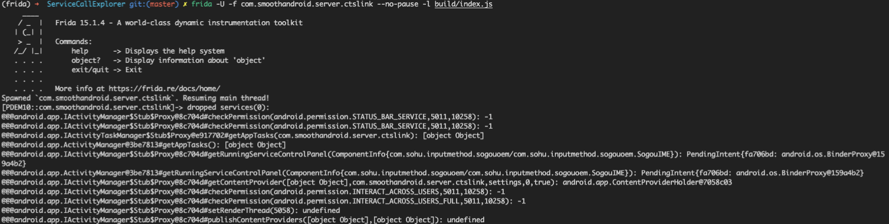
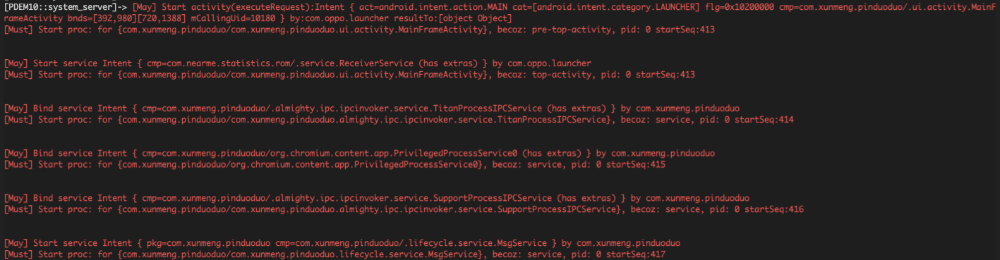

**Caveats: all scripts are designed for android 11 (SDK 30)**

## ServiceCallExplorer

### Intro

frida snippet empowers you to instrument all service-call (IPC call through well-known system-services) by their names and pattern

### Workflow

1. import `vinstrument` | `instrument` from `ServiceCallExplorer.ts`
2. config your watch point by apply service names as arguments to `vinstrument` or config a `DesignatedSignatureServiceType` (which accept a regex filter array for method name and a `noisy` option to mute/unmute stacktrace printing) param to `instrument`
   a built-in `SignificantServiceTypes` type is provided to assist typescript auto-completion
   additional, predefined configurations for common usage are also supplied as `Predefined.JustWander`, `Predefined.PrivacyMonitor`,`MaliciousAppMonitor`, feel free to utilize or override them
3. `npm run watch` | `npm run build`
4. have run

### Sample Output

## SpawnExplorer

### Intro

frida snippets pair each process spawn with corresponding caller (who caused the spawn and the target component)

### Workflow

1. import `penetrate` from `SpawnExplorer.ts`
2. config `tracer` (debug log) and `fatal` (output log) for `penetrate`
3. attach to `system_server`

### Sample Output

